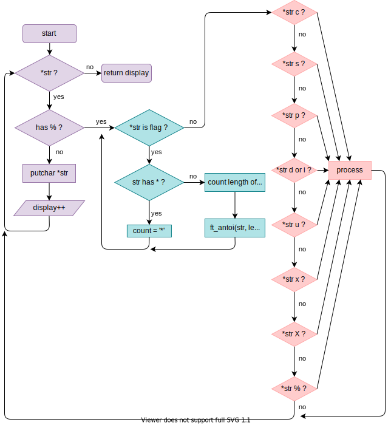

<!-- Title of the project -->
# Printf
<!-- Quick presentation about the project -->
Printf is a [42 school](https://www.42.fr/) project. It consists to recode the [printf](https://www.wikiwand.com/fr/Printf) (who mean print formatted) function with just the basics flags and arguments.
<!-- If the project is visual, a little demo here -->
<!-- And a funny sentence here -->
> Hello World !


<!-- Table of content -->
## Table of content
- [Getting started](#getting-started)
	- [Dependencies](#dependencies)
	- [Installing](#installing)
- [Usage](#usage)
- [Pedagogy](#flowchart)
	- [Tests](#tests)
	- [Norm](#norm)
	- [Flowchart](#flowchart)
	- [Resources](#resources)
- [Author](#author)
<!-- Getting started -->
## Getting started

<!-- What I use ? Library ? -->
### Dependencies
- Library [libft](https://github.com/agatocherry/libft)

<!-- How install the repository and make -->
### Installing
Clone the repository :
```console
$ git clone https://github.com/agatocherry/printf.git
```
<!-- Note for myself : the command for add git module, is : `git submodule add https://github.com/agatocherry/libft.git` -->

Change it to your working directory and run :
```console
$ make
```

<!-- How we can use the project -->
## Usage
You can use my printf with your own C file. You need to include my printf.h :
```C
#include ./includes/printf.h
```
And you can compile :
```console
$ gcc your_file.c libftprintf.a
```

<!-- Pedagogy -->
## Pedagogy
This part is for 42 students. Please, don't copy and past, the key of the progress is the practice. However, you can use this resources below as you want.

<!-- How I can use the tests if I have one ? -->
### Tests
You can test printf like that :
```console
$ cd tests
$ bash tests.sh
```
I also have a [workflow](./.github/workflows/tests.yml) feel free to use it.

<!-- Norm facts -->
### Norm
[Norm v2](https://github.com/42Paris/norminette), here a [workflow](./.github/workflows/norm.yml) feel free to use it.

<!-- Share my own flowchart -->
### Flowchart
I do a flowchart about how my code is working.



<!-- Resources I used -->
### Resources
- Subject [en](./docs/subject.pdf) | [fr](./docs/sujet.pdf)
- [Book the secret of printf](https://www.cypress.com/file/54441/download)
- [Testers list](https://github.com/Kwevan/42-Tests#ft_printf)

## Author

[@agatocherry](https://github.com/agatocherry) 👩🏼‍💻
